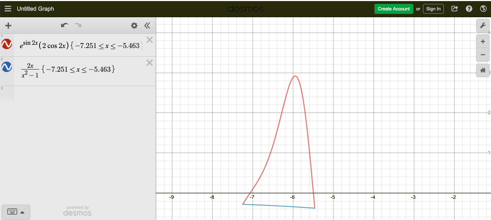
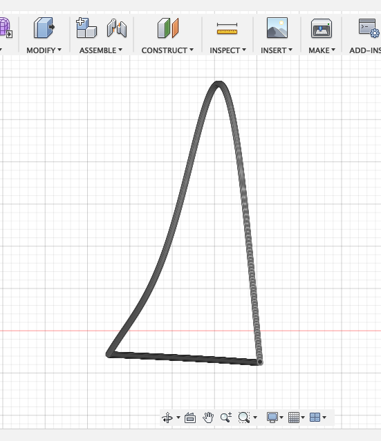
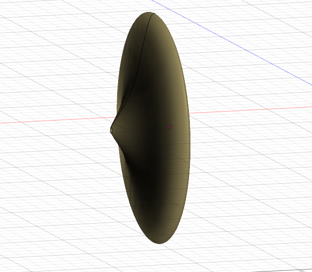

# CalcBC_Project
Codes I used for calculating the points on the graphs for international CAD project in my Calc BC class. Programmed in C.


Graph of two formulas within the domain I set: https://www.desmos.com/calculator/w5dqwm0tgj

Two endpoints I chose are `x ≈ -7.251` and `x ≈ -5.463`, and it looks like this.




I wrote codes for 1) x-values, 2) first formula and 3) second formula. 

For compiling and running codes in C try commands below on your terminal (or CUI app)...

```
gcc -o [filename].exe [filename].c
```
and then
```
./[filename].exe
```

Then I copied and pasted the results on google spreadsheet, and then exported the XYZ values in .csv file, which I directly imported to Fusion360.

(the importing process took very long because I tried to plot 1789 points x2 graphs)




Then I revolved the plotted graph around y ≈ 0.3788, because that is where Fusion360 doesn't give the solids-overlapping error. 


